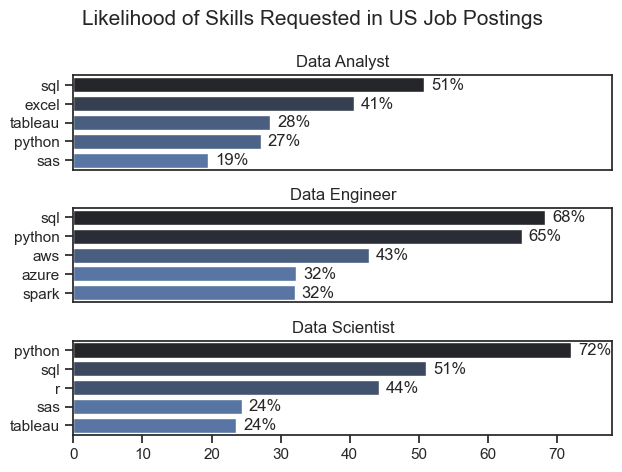
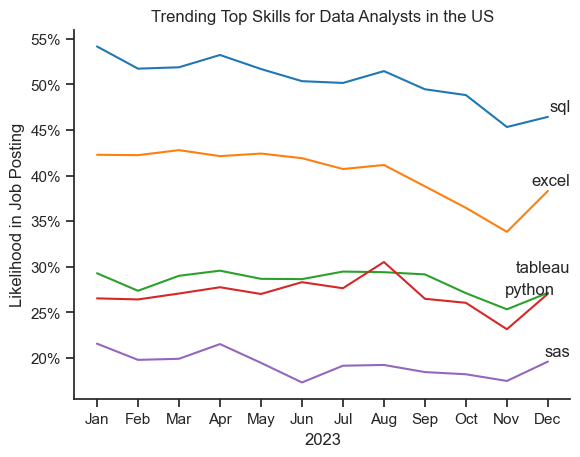

# The Analysis

## 1. What are the most demanded skills for the top 3 most popular data roles?

To find the most demanded skills, I filtered and retrieved the top 5 skills for each of the top 3 most popular data roles.

View my notebook with detailed steps here:
[2_Skill_Demand.ipynb](3_Project/2_Skill_Demand.ipynb)

### Visualize Data
```python
fig, ax = plt.subplots(len(job_titles), 1)

sns.set_theme(style = 'ticks')

for i, job_title in enumerate(job_titles):
    df_plot = df_skills_perc[df_skills_perc['job_title_short'] == job_title].head(5)
    # df_plot[::-1].plot(x = 'job_skills', y = 'skill_percent', kind = 'barh', ax = ax[i], title = job_title)
    sns.barplot(data = df_plot, x = 'skill_percent', y = 'job_skills', ax = ax[i], hue = 'skill_count', palette = 'dark:b_r')
    # ax[i].invert_yaxis()
    ax[i].set_title(job_title)
    ax[i].set_ylabel('')
    ax[i].set_xlabel('')
    ax[i].legend().set_visible(False)
    ax[i].set_xlim(0, 78)

    for index, value in enumerate(df_plot['skill_percent']):
        ax[i].text(value + 1, index, f'{value:.0f}%', va = 'center')
    if i != len(job_titles) - 1:
        ax[i].set_xticks([])


fig.suptitle('Likelihood of Skills Requested in US Job Postings', fontsize = 15)
fig.tight_layout()
plt.show() 
```

### Results


### Insights
- Python and SQL are the most requested skills overall.
- For Data Engineers, a larger amount of cloud skills are requested.

## 2. How are in-demand skills trending for Data Analysts?

To find the trends for in-demand skills over time, I filtered job postings by skills required and calculated them as a percentage of all job postings for each month in 2023. I then visualized it with a line plot in Seaborn. 

View my notebook with detailed steps here: [3_Skills_Trend.ipynb](3_Project/3_Skills_Trend.ipynb)

### Visualize Data
```python
df_plot = df_DA_US_percent.iloc[:, :5]
from adjustText import adjust_text

sns.lineplot(data = df_plot, dashes = False, palette = 'tab10')
sns.set_theme(style = 'ticks')
sns.despine()

plt.title('Trending Top Skills for Data Analysts in the US')
plt.ylabel('Likelihood in Job Posting')
plt.xlabel('2023')
plt.legend().remove()

from matplotlib.ticker import PercentFormatter
ax = plt.gca()
ax.yaxis.set_major_formatter(PercentFormatter(decimals=0))

texts = []
for i in range(5):
    texts.append(plt.text(11.2, df_plot.iloc[-1, i], df_plot.columns[i]))

adjust_text(texts)


plt.show()
```

### Results

*Line plot visualizing trending top skills for Data Analysts in the US in 2023*

### Insights
- Demand for SQL and Excel knowhow is decreasing
- Demand for Python, Tableau and Sas is relatively stable
