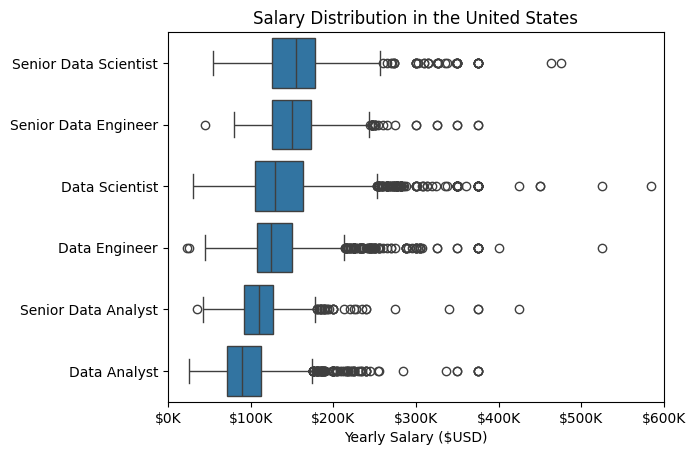
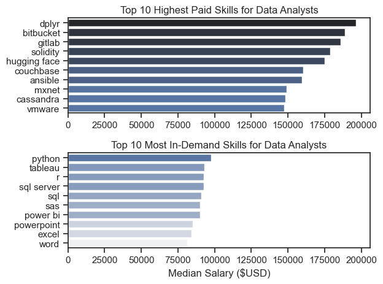
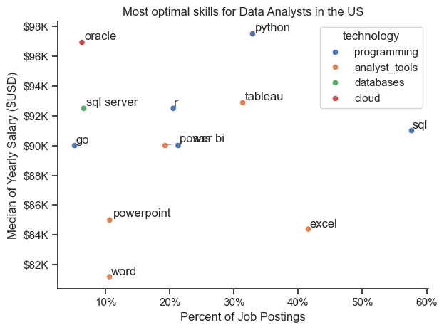

# The Analysis

## 1. What are the most demanded skills for the top 3 most popular data roles?

To find the most demanded skills, I filtered and retrieved the top 5 skills for each of the top 3 most popular data roles.

View my notebook with detailed steps here:
[2_Skill_Demand.ipynb](3_Project/2_Skill_Demand.ipynb)

### Visualize Data
```python
fig, ax = plt.subplots(len(job_titles), 1)

sns.set_theme(style = 'ticks')

for i, job_title in enumerate(job_titles):
    df_plot = df_skills_perc[df_skills_perc['job_title_short'] == job_title].head(5)
    # df_plot[::-1].plot(x = 'job_skills', y = 'skill_percent', kind = 'barh', ax = ax[i], title = job_title)
    sns.barplot(data = df_plot, x = 'skill_percent', y = 'job_skills', ax = ax[i], hue = 'skill_count', palette = 'dark:b_r')
    # ax[i].invert_yaxis()
    ax[i].set_title(job_title)
    ax[i].set_ylabel('')
    ax[i].set_xlabel('')
    ax[i].legend().set_visible(False)
    ax[i].set_xlim(0, 78)

    for index, value in enumerate(df_plot['skill_percent']):
        ax[i].text(value + 1, index, f'{value:.0f}%', va = 'center')
    if i != len(job_titles) - 1:
        ax[i].set_xticks([])


fig.suptitle('Likelihood of Skills Requested in US Job Postings', fontsize = 15)
fig.tight_layout()
plt.show() 
```

### Results


### Insights
- Python and SQL are the most requested skills overall.
- For Data Engineers, a larger amount of cloud skills are requested.

## 2. How are in-demand skills trending for Data Analysts?

To find the trends for in-demand skills over time, I filtered job postings by skills required and calculated them as a percentage of all job postings for each month in 2023. I then visualized it with a line plot in Seaborn. 

View my notebook with detailed steps here: [3_Skills_Trend.ipynb](3_Project/3_Skills_Trend.ipynb)

### Visualize Data
```python
df_plot = df_DA_US_percent.iloc[:, :5]
from adjustText import adjust_text

sns.lineplot(data = df_plot, dashes = False, palette = 'tab10')
sns.set_theme(style = 'ticks')
sns.despine()

plt.title('Trending Top Skills for Data Analysts in the US')
plt.ylabel('Likelihood in Job Posting')
plt.xlabel('2023')
plt.legend().remove()

from matplotlib.ticker import PercentFormatter
ax = plt.gca()
ax.yaxis.set_major_formatter(PercentFormatter(decimals=0))

texts = []
for i in range(5):
    texts.append(plt.text(11.2, df_plot.iloc[-1, i], df_plot.columns[i]))

adjust_text(texts)


plt.show()
```

### Results

*Line plot visualizing trending top skills for Data Analysts in the US in 2023*

### Insights
- Demand for SQL and Excel knowhow is decreasing
- Demand for Python, Tableau and Sas is relatively stable


## 3. How well do jobs pay for Data Analysts?

I grouped jobs together by their job titles and sorted and visualized their salary distributions in order to see what types of data jobs payed the best.

View my notebook with detailed steps here: [4_Salary_Analysis.ipynb](3_Project/4_Salary_Analysis.ipynb)

### Visualize Data
```python
# Finding order of medians to make it look nicer
job_order = df_US_top6.groupby('job_title_short')['salary_year_avg'].median().sort_values(ascending = False).index

# Box plots in seaborn

sns.boxplot(df_US_top6, x = 'salary_year_avg', y = 'job_title_short', order = job_order)
# plt.boxplot(job_list, labels = job_titles, vert = False)
plt.title('Salary Distribution in the United States')
plt.ylabel('')
plt.xlabel('Yearly Salary ($USD)')
ax = plt.gca()
ax.xaxis.set_major_formatter(plt.FuncFormatter(lambda x, pos: f'${int(x/1000)}K'))
plt.xlim(0, 600000)
plt.show()
```

### Results 

*Box plot visualizing top 6 data jobs with their salary distributiions*

### Insights
- Senior data jobs pay more than their respective counterparts as expected, but senior Data Analysts seem to be paid less than their junior engineer and scientist counterparts, which is surprising. 
- Data Scientists are paid the best by a decent margin (up to $600k).

## 4. How well do skills pay for Data Analysts?
I did the same for the data technical skills to see which skills payed the best.

View my notebook with detailed steps here: [4_Salary_Analysis.ipynb](3_Project/4_Salary_Analysis.ipynb)

### Visualize Data
```python
fig, ax  = plt.subplots(2, 1)

# Graphing highest paid skills
sns.barplot(data = df_DA_top_pay, x = 'median', y = df_DA_top_pay.index, ax = ax[0], hue = 'median', palette = 'dark:b_r') # r is to reverse order
ax[0].set_title('Top 10 Highest Paid Skills for Data Analysts')
ax[0].set_ylabel('')
ax[0].set_xlabel('')
ax[0].legend().remove()

# Graphing Median Salary against most demanded skills
sns.barplot(data = df_DA_skills, x = 'median', y = df_DA_skills.index, ax = ax[1], hue = 'median', palette = 'light:b')
ax[1].set_title('Top 10 Most In-Demand Skills for Data Analysts')
ax[1].set_ylabel('')
ax[1].set_xlabel('Median Salary ($USD)')
ax[1].legend().remove()

# Making xlims same
ax[1].set_xlim(ax[0].get_xlim())

fig.tight_layout()
```
### Results

*Bar plot visualising median salaries for top job skills and top median salaries with their skills*

### Insights
- It pays more to know programmatic visualization language rather than user-friendly softwares such as Excel or Word 
- There are skills that pay more than most demanded programming languages, however the demand for these niche languages in general are very low

## 5. What are the most optimal skills to learn for Data Analysts?
I grouped skills based on demand and pay in a single DataFrame and visualized these attributes together in order to find the most optimal skills


### Visualize Data
``` python
from adjustText import adjust_text

sns.scatterplot(data = df_plot, x = 'skill_perc', y = 'median_salary', hue = 'technology')

sns.despine()
sns.set_theme(style = 'ticks')

texts = []
for i, txt in enumerate(df_DA_US_high_demand.index):
    texts.append(plt.text(df_DA_US_high_demand['skill_perc'].iloc[i], df_DA_US_high_demand['median_salary'].iloc[i], txt))

adjust_text(texts, arrowprops = dict(arrowstyle = '->', color = 'gray', lw = 0.5)) # Meant to space out scatter labels


ax = plt.gca()
from matplotlib.ticker import PercentFormatter
ax.yaxis.set_major_formatter(plt.FuncFormatter(lambda y, pos: f'${int(y/1000)}K'))
ax.xaxis.set_major_formatter(PercentFormatter(decimals = 0))

plt.xlabel('Percent of Job Postings')
plt.ylabel('Median of Yearly Salary ($USD)')
plt.title('Most optimal skills for Data Analysts in the US')
plt.tight_layout()
plt.show()
```

### Results

*Scatter plot visualising top skills with their percentage demand in job posting in the US and median pay*

### Insights
- Python, SQL and Tableau are the most optimal empirically.
- Programming technologies and analyst tools are more optimal than other technology types.